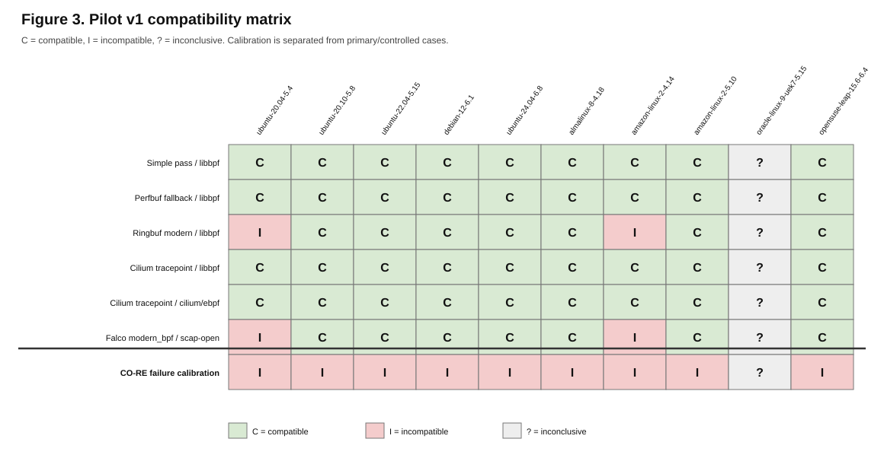
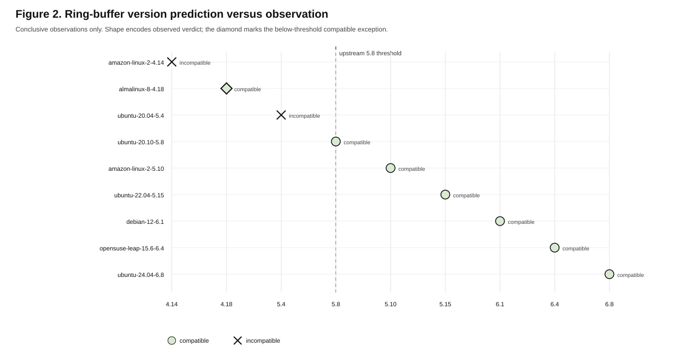
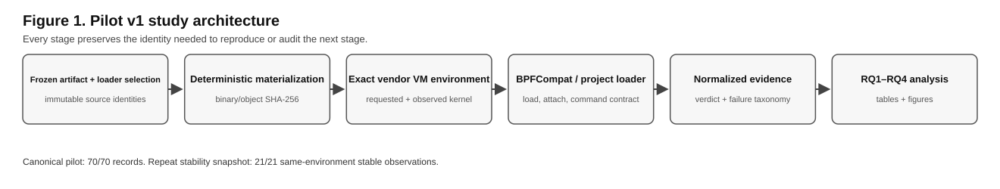

# Kernel Version Is Not a Capability Contract: Empirical eBPF Artifact Compatibility Across Linux Vendor Kernels

**Eren Arı**

Preprint manuscript draft — September 2026  
**Not peer reviewed.**

## Abstract

eBPF portability is often reasoned about using kernel version, CO-RE, BTF, and
upstream feature-introduction points. Those mechanisms are important, but the
kernel version string is not itself a complete capability contract: distribution
kernels can carry backports, rebases, configuration differences, and distinct
userspace loader behavior. This paper presents an empirical pilot study using
BPFCompat, a harness that boots real Linux distribution kernels in disposable
virtual machines and evaluates compiled eBPF artifacts through libbpf or
project-specific loader paths.

The frozen x86_64 pilot contains seven validation cases across ten logical Linux
profiles, yielding 70/70 planned execution records. Overall, 50 observations
were compatible, 13 incompatible, and 7 inconclusive. Excluding a deliberately
failing calibration case, the study contains 60 attempts: 50 compatible, 4
incompatible, and 6 inconclusive. For a controlled
`BPF_MAP_TYPE_RINGBUF` probe, a simple upstream Linux 5.8 threshold agreed
with 8 of 9 conclusive observations (88.889%); AlmaLinux 8's observed 4.18
vendor kernel was the below-threshold compatible exception. The dataset also
contains two cross-vendor version inversions: for both the ring-buffer probe and
the Falco `modern_bpf` real-loader path, the older-numbered AlmaLinux 8/4.18
environment passed while Ubuntu 20.04/5.4 failed. Paired Cilium-derived
libbpf and cilium/ebpf paths produced zero verdict disagreements across nine
conclusive exact environments, but their validation contracts differ, so this
does not estimate a pure loader causal effect. A purposefully stratified
post-collection repeat sample reran seven canonical tuples three times each;
all 21/21 repeats matched the canonical verdict on the same exact environment,
with zero observed environment drift and zero same-environment verdict
instability.

These are descriptive results from a selected pilot, not population estimates
for Linux deployments. The contribution is the reproducible measurement
boundary: immutable artifact identities, exact booted environment identities,
explicit validation contracts, raw and normalized evidence, deterministic
analysis, generated figures and tables, a frozen GitHub research release, and a
DOI-bearing Zenodo dataset.

**Dataset:** https://doi.org/10.5281/zenodo.22848155

## 1. Introduction

eBPF has become a general kernel programmability mechanism used for networking,
observability, tracing, and security. Prior work has studied eBPF's execution
model, performance, verifier safety, and application design [1,2]. In parallel,
BPF CO-RE combines BTF, compiler relocation information, and loader support to
make compiled programs more portable across kernel data-structure changes
[3–6].

Portability, however, is broader than type relocation. A compiled eBPF artifact
can still depend on a map type, program type, helper, attach mechanism, verifier
behavior, kernel configuration, BTF availability, capability model, or
project-specific loader contract. Distribution kernels also evolve through
stable-update processes, backports, hardware-enablement kernels, and vendor
patch series rather than by mirroring upstream version numbers exactly
[7–9]. Consequently, a release engineering question such as “will this exact
artifact load and attach on the kernels my users run?” cannot always be reduced
to an upstream version comparison.

This paper evaluates that narrower operational question empirically. BPFCompat
executes compiled artifacts against real booted vendor environments and records
structured evidence from the validation path. The pilot does not attempt to
estimate global Linux compatibility, nor does it claim that kernel versions are
useless. Instead, it asks whether version ordering alone is sufficient to serve
as a capability ordering for the selected artifacts and environments.

The study addresses four research questions:

- **RQ1:** How predictive is kernel version of observed eBPF compatibility?
- **RQ2:** Why do otherwise portable eBPF artifacts fail?
- **RQ3:** How much does the loader path affect the observed verdict?
- **RQ4:** How do vendor and exact-environment differences affect the
  relationship between version and compatibility?

The paper makes five bounded contributions:

1. an empirical compatibility protocol based on exact artifact, environment, and
   validation-contract identities;
2. a frozen 70-attempt pilot dataset spanning ten logical vendor-kernel profiles;
3. deterministic RQ1–RQ4 analysis and generated paper assets;
4. concrete version-order counterexamples in which an older-numbered vendor
   kernel passes while a newer-numbered kernel fails; and
5. an independently archived, DOI-bearing reproducibility package.

The central conclusion is deliberately limited: **within this pilot, kernel
version is useful context but is not sufficient as a capability contract.**
Observed compatibility is a property of an artifact/loader and an exact runtime
environment, not of a version string alone.

## 2. Background and related work

### 2.1 eBPF execution and verification

eBPF allows user-provided programs to execute in kernel-controlled contexts
after passing kernel safety checks. The verifier is a critical part of this
model, and research has examined its precision, scalability, and safety
properties [2]. Surveys of eBPF and XDP describe the broader execution model and
its use in high-performance packet processing [1].

This study does not propose a new verifier. It treats the kernel's actual load
or attach result, plus the selected userspace loader contract, as measurement
evidence.

### 2.2 BTF and CO-RE portability

BTF encodes type information used by the kernel and loaders, while `.BTF.ext`
can carry CO-RE relocation metadata [4,5]. libbpf's CO-RE flow matches
relocation information in a BPF object against BTF from the running kernel
[3]. The CO-RE design was explicitly motivated by the difficulty of keeping BPF
programs portable as kernel data structures evolve [6].

CO-RE therefore addresses an important portability dimension, but it does not
turn every eBPF capability into a stable version-independent interface. Map
types, program types, attach hooks, helpers, kernel configuration, verifier
behavior, and loader-specific setup remain relevant. The present study measures
that residual operational compatibility rather than treating CO-RE as a
guarantee of loadability.

### 2.3 Vendor kernels and backports

Linux stable trees and distribution kernels routinely integrate fixes and other
changes onto maintained kernel lines [8,9]. Canonical documents separate GA,
hardware-enablement, cloud, OEM, and other Ubuntu kernel variants and describe
stable-release update flows that incorporate upstream stable updates, fixes,
security patches, and hardware-enablement changes [7].

This motivates preserving two identities in compatibility evidence:

- the **logical profile** requested by the study; and
- the **exact environment** that actually booted, including the observed kernel
  release and image identity.

The distinction matters because a logical “5.15” target can fail to materialize
as an observed 5.15 runtime, as occurred for the Oracle profile in this pilot.

### 2.4 Loader-path diversity

The Linux kernel documentation describes libbpf as a userspace library for
loading and managing BPF programs, including CO-RE relocation support [3].
cilium/ebpf is a separate pure-Go implementation that can load BPF programs and
attach them to Linux hooks [10]. Falco's modern BPF path is a real-world
project-specific loader path with its own setup and runtime assumptions [11].

Because these paths are not semantically identical, this paper does not treat
agreement between two loaders as proof of loader equivalence. RQ3 reports
observed agreement only where the exact environment is shared, and preserves
the contract difference explicitly.

## 3. Study design

### 3.1 Unit of observation

The primary observation is an execution tuple:

```text
artifact_or_loader × exact_kernel_environment × architecture × validation_contract
```

The study retains both logical-profile identity and exact-environment identity.
An unavailable or mismatched requested environment is not silently substituted
and counted as a compatibility result.

### 3.2 Frozen corpus

Pilot v1 contains seven cases:

| Case | Role | Execution contract |
| --- | --- | --- |
| `simple-pass-libbpf` | controlled probe | libbpf load + attach |
| `perfbuf-fallback-libbpf` | controlled probe | libbpf load + attach |
| `ringbuf-modern-libbpf` | controlled probe | libbpf load + attach |
| `cilium-tracepoint-libbpf` | OSS-derived | libbpf load + attach |
| `cilium-tracepoint-ebpf-go` | OSS-derived | cilium/ebpf load-only command |
| `falco-modern-bpf-scap-open` | real-world project loader | Falco `scap-open` command |
| `core-relocation-fail-libbpf` | calibration | libbpf load-only |

The full frozen corpus, source revisions, loader identities, and contract hashes
are generated in
[`research/paper/generated/tables/table-1-corpus-contracts.md`](../../research/paper/generated/tables/table-1-corpus-contracts.md).

The calibration case is intentionally failing and is never mixed into
real-world compatibility prevalence.

### 3.3 Kernel environments

Ten logical profiles were selected across Ubuntu, Debian, AlmaLinux, Amazon
Linux, openSUSE, and Oracle Linux. The exact observed environment table is
generated at
[`research/paper/generated/tables/table-3-environments.md`](../../research/paper/generated/tables/table-3-environments.md).

Nine profiles booted the requested kernel family. The Oracle logical profile
requested kernel family 5.15 but booted:

```text
6.12.0-107.59.3.3.el9uek.x86_64
```

Its seven study executions are therefore retained as **inconclusive** for the
requested profile rather than relabeled as 5.15 observations.

### 3.4 Outcomes

Each execution is normalized to:

- **compatible**
- **incompatible**
- **inconclusive**

Infrastructure errors, unavailable requested environments, and insufficient
evidence remain inconclusive rather than being converted into compatibility
failures.

### 3.5 RQ1: version predictiveness

RQ1 uses the controlled ring-buffer probe and a simple upstream introduction
threshold: Linux 5.8. The frozen study records upstream commit
`457f44363a8894135c85b7a9afd2bd8196db24ab` as the feature-introduction
reference.

For each conclusive environment, the version-only rule predicts:

- kernel series < 5.8 → incompatible;
- kernel series ≥ 5.8 → compatible.

The prediction is then compared with the observed verdict.

This is intentionally a simple baseline, not a claim that version-threshold
logic is the best possible compatibility model.

### 3.6 RQ2: failure taxonomy

Incompatible observations are assigned a normalized classification only where
the captured evidence supports it. Calibration and non-calibration results are
reported separately.

### 3.7 RQ3: loader-path observation

The Cilium-derived object is evaluated through two paths on the same exact
environments:

- BPFCompat's static libbpf validator using **load + attach**;
- a cilium/ebpf loader using **load only**.

Because the success contracts differ, RQ3 reports verdict agreement but does
not estimate a pure causal loader effect.

### 3.8 RQ4: vendor and environment variation

RQ4 preserves exact observed kernel versions and searches for cross-vendor
version inversions: a case where an older-numbered kernel is compatible while a
newer-numbered kernel is incompatible for the same case.

The pilot has only one exact environment per logical profile, so patch-level
longitudinal change is not estimable.

### 3.9 Repeat-run stability

After the canonical collection was frozen, seven tuples were selected using a
purposeful stratified design covering:

- compatible controlled behavior;
- incompatible controlled behavior;
- a compatible vendor-backport case;
- compatible and incompatible real-loader cases;
- a compatible project-loader case; and
- the inconclusive Oracle environment-mismatch case.

Each tuple was repeated three times, for 21 planned attempts. Verdict
instability is counted only when the repeat uses the same exact environment;
environment drift is measured separately.

### 3.10 Reproducibility controls

The research pipeline binds:

1. study specification;
2. source/materialized artifact identities;
3. exact environment identities;
4. raw execution evidence;
5. normalized datasets;
6. deterministic RQ analysis;
7. repeat-run provenance;
8. generated figures/tables;
9. archive manifest and checksums;
10. a research-specific GitHub release; and
11. a Zenodo dataset DOI.

The frozen dataset is:

**Arı, E. (2026). BPFCompat Research Dataset v1: Empirical eBPF Compatibility
Across Linux Vendor Kernels (Version research-v1) [Dataset]. Zenodo.
https://doi.org/10.5281/zenodo.22848155**

## 4. Results

### 4.1 Collection completeness

All **70/70 planned executions** were captured.

| Scope | Attempts | Evaluable | Compatible | Incompatible | Inconclusive |
| --- | ---: | ---: | ---: | ---: | ---: |
| Overall | 70 | 63 | 50 | 13 | 7 |
| Non-calibration | 60 | 54 | 50 | 4 | 6 |
| Calibration | 10 | 9 | 0 | 9 | 1 |

The Oracle environment mismatch is responsible for the seven overall
inconclusive observations: one per case.

The compatibility matrix is generated as:



### 4.2 RQ1 — kernel-version predictiveness

For the ring-buffer probe, the Linux 5.8 threshold agreed with **8 of 9
conclusive observations (88.889%)**.

Confusion counts for the selected version-only rule were:

| Measure | Count |
| --- | ---: |
| True positive | 6 |
| True negative | 2 |
| False positive | 0 |
| False negative | 1 |

This corresponds to 85.714% sensitivity and 100% specificity **within this
nine-observation pilot comparison**. These percentages are descriptive and
should not be interpreted as population performance estimates.

The disagreement was:

- **AlmaLinux 8**
- observed kernel: `4.18.0-553.158.1.el8_10.x86_64`
- version-only prediction: incompatible
- observed verdict: compatible

The ring-buffer result is visualized in:



This observation is sufficient to reject strict monotonic capability ordering
by raw version number for this feature in the selected environments. It does
not establish which individual vendor patch caused support; the result is
consistent with vendor-maintained capability backporting or rebasing, but the
pilot does not isolate that mechanism.

### 4.3 RQ2 — observed failure taxonomy

Outside calibration, there were four incompatible observations among 54
evaluable attempts:

| Classification | Count | Evaluable denominator |
| --- | ---: | ---: |
| `UNSUPPORTED_MAP_TYPE` | 2 | 54 |
| `COMMAND_VALIDATION_FAILURE` | 2 | 54 |

The two `UNSUPPORTED_MAP_TYPE` observations were produced by the ring-buffer
controlled probe on:

- Amazon Linux 2 / observed 4.14; and
- Ubuntu 20.04 / observed 5.4.

The two `COMMAND_VALIDATION_FAILURE` observations were produced by the Falco
`modern_bpf` real-loader path on those same logical profiles.

The calibration case produced nine evaluable failures:

- 8 × `CORE_RELOCATION_FAILURE`;
- 1 × `MISSING_BTF`.

Those calibration results demonstrate classification coverage and are reported
separately from non-calibration compatibility results.

The generated failure table is available at
[`table-2-failure-taxonomy.md`](../../research/paper/generated/tables/table-2-failure-taxonomy.md).

### 4.4 RQ3 — paired loader-path observation

Across the nine conclusive exact environments, the paired Cilium-derived paths
had **0 verdict disagreements**.

Observed pair matrix:

| libbpf path | cilium/ebpf path | Count |
| --- | --- | ---: |
| compatible | compatible | 9 |
| inconclusive | inconclusive | 1 |

This should not be read as evidence that libbpf and cilium/ebpf are equivalent
loaders. The contracts differ:

- libbpf path: **load + attach**;
- cilium/ebpf path: **load only**.

The correct interpretation is narrower: the two selected paths did not disagree
on verdict in the nine conclusive exact environments tested.

### 4.5 RQ4 — cross-vendor version inversions

The pilot contains **two cross-vendor version inversions**, both comparing the
older-numbered AlmaLinux 8/4.18 environment against Ubuntu 20.04/5.4:

| Case | Older compatible environment | Newer incompatible environment |
| --- | --- | --- |
| `ringbuf-modern-libbpf` | AlmaLinux 8 / 4.18.0-553.158.1.el8_10 | Ubuntu 20.04 / 5.4.0-216 |
| `falco-modern-bpf-scap-open` | AlmaLinux 8 / 4.18.0-553.158.1.el8_10 | Ubuntu 20.04 / 5.4.0-216 |

These inversions are the strongest direct evidence for the paper's title:
within the selected cases, numerical kernel ordering did not imply capability
ordering.

The pilot contains ten exact environments across ten logical profiles.
Patch-level longitudinal change is **not evaluable** because there is only one
canonical exact environment per logical profile.

### 4.6 Repeat-run stability

The post-collection repeat sample completed **21/21** planned attempts:

| Measure | Result |
| --- | ---: |
| Planned attempts | 21 |
| Observed attempts | 21 |
| Stable on same exact environment | 21 |
| Environment drift | 0 |
| Same-environment verdict instability | 0 |

This is evidence that the seven selected tuples were stable under the bounded
repeat design. It is not an estimate of nondeterminism across all BPFCompat
cases, kernels, clouds, or future package versions.

The generated repeat table is available at
[`table-4-repeat-stability.md`](../../research/paper/generated/tables/table-4-repeat-stability.md).

## 5. Discussion

### 5.1 What the version inversions mean

A common compatibility heuristic is monotonic: if a feature entered upstream at
version *v*, kernels newer than *v* are expected to support it and kernels older
than *v* are expected not to. This is useful as a default model, and it worked
for eight of nine conclusive ring-buffer observations in the pilot.

The AlmaLinux 8/4.18 result demonstrates why the heuristic is not a contract.
The exact older-numbered vendor kernel accepted a probe that Ubuntu 20.04/5.4
rejected. The Falco real-loader path exhibited the same ordering inversion.
Therefore, at least for these selected artifacts and vendor environments,
capability must be measured from the actual environment rather than inferred
solely from the version tuple.

### 5.2 Why exact-environment identity matters

The Oracle profile provides the complementary failure mode. A study may request
a logical kernel family and still boot something different. If the observed
kernel identity were discarded, those seven rows could be incorrectly
attributed to Oracle 5.15.

The pilot therefore treats environment materialization as part of the evidence,
not merely infrastructure. A compatibility verdict without the exact
environment identity is weaker evidence because the target itself may have
drifted.

### 5.3 Loader contracts are part of compatibility

Compatibility is also not solely a property of a `.bpf.o` file. The userspace
loader can size maps, select program variants, perform feature probes, apply
relocations, and choose attach mechanisms. The Falco case therefore uses a real
project loader, while the Cilium-derived pair is kept explicitly contract-aware.

This suggests a practical hierarchy for release testing:

1. use a controlled generic validator to isolate kernel mechanisms;
2. where possible, execute the project's actual supported loader path;
3. record the success contract and binary identity;
4. do not compare different contracts as if they were identical experiments.

### 5.4 Implications for CI and release engineering

The pilot supports a release-engineering pattern rather than a universal
compatibility oracle:

- freeze the artifact;
- select target vendor environments;
- boot and identify the exact kernels;
- execute the real load/attach or project-loader path;
- preserve structured evidence;
- treat incompatibility and infrastructure failure separately;
- rerun a bounded stability sample; and
- archive the evidence used for release decisions.

Version rules, CO-RE, BTF, and feature databases remain useful inputs. Empirical
execution adds evidence about the final artifact/loader/environment combination
that those inputs alone do not provide.

## 6. Threats to validity

### 6.1 Selection bias

The corpus is intentionally small and stratified. It contains controlled probes,
two paths around one Cilium-derived artifact, one Falco real-loader case, and
one calibration case. It is not a random or representative sample of the eBPF
ecosystem.

### 6.2 Environment coverage

The canonical collection is x86_64 only and contains one exact environment per
logical profile. The wider BPFCompat product supports additional profiles and
architectures, but those are outside this frozen pilot and must not be treated
as study observations.

### 6.3 Vendor attribution

The AlmaLinux 8/4.18 compatibility observation is consistent with vendor-side
backporting or rebasing, but this pilot does not perform patch-level causal
attribution. The claim is observational: the exact kernel accepted the tested
artifact.

### 6.4 Oracle profile mismatch

The requested Oracle 5.15 profile booted 6.12 UEK. The study therefore marks
all seven Oracle rows inconclusive for the requested profile. This reduces the
evaluable denominator and illustrates why environment verification is necessary.

### 6.5 Loader comparability

The paired Cilium-derived paths use different contracts. Their zero observed
disagreements cannot be interpreted as proof that loader implementation has no
effect.

### 6.6 Repeat-sample scope

The 21-repeat sample was selected purposefully after the canonical collection
to cover important strata. It measures stability of those exact tuples only and
does not provide a population-wide instability rate.

### 6.7 Successful load is not full application correctness

A load/attach or loader-command success proves the operational contract defined
for that case. It does not by itself prove semantic correctness, performance,
security, or production suitability of the complete application.

## 7. Reproducibility and artifact availability

### 7.1 Frozen dataset

The exact pilot-v1 dataset is archived at:

**Version DOI:** https://doi.org/10.5281/zenodo.22848155

The evolving dataset family has concept DOI:

https://doi.org/10.5281/zenodo.22848154

The exact-version DOI should be used for reproducing this paper.

### 7.2 GitHub research release

The corresponding research release is:

https://github.com/Kernel-Guard/bpfcompat/releases/tag/research-v1

The annotated tag resolves to the frozen study publication point. The release
contains:

- `archive-manifest.json`
- `archive-lock.json`
- `bpfcompat-research-v1-payload.zip`
- `RELEASE-CHECKSUMS.txt`

### 7.3 Deterministic paper assets

Three figures and four tables are generated deterministically from the frozen
normalized evidence. Their input/output hashes are recorded in:

[`research/paper/generated/asset-manifest.json`](../../research/paper/generated/asset-manifest.json)

Figure 1 summarizes the evidence pipeline:



### 7.4 Evidence boundary

The archive excludes third-party compiled loader binaries where the v1
redistribution review did not establish a complete transitive notice set.
Reproducibility is preserved through hashes, source revisions, validation
contract identities, notices, and rebuild provenance.

## 8. Related work

Research on eBPF spans execution, verification, networking performance,
security, and portability. Vieira et al. survey eBPF and XDP concepts,
applications, and performance-oriented use cases [1]. Gershuni et al. study
static verification of untrusted Linux kernel extensions and the precision and
scalability challenges of eBPF verification [2].

BTF and CO-RE address binary portability across kernel data-structure changes
by combining type metadata, relocations, and loader support [3–6]. Linux and
distribution documentation separately describe stable-kernel maintenance,
backporting, and distribution-specific kernel update processes [7–9].
cilium/ebpf provides a distinct Go-based loading implementation [10], while
Falco provides a real-world BPF security/observability loader path [11].

This pilot complements those mechanisms and systems with a release-artifact
measurement perspective: given an immutable compiled artifact or loader,
what verdict is observed on an exact vendor environment? The study does not
claim that empirical VM execution replaces verifier analysis, CO-RE, BTF,
feature probing, or project tests. It treats those methods as complementary
layers of evidence.

## 9. Conclusion

The BPFCompat pilot demonstrates a narrow but important result: for the selected
eBPF artifacts and vendor environments, raw kernel-version ordering was not a
complete capability ordering. A version-only Linux 5.8 threshold correctly
predicted eight of nine conclusive ring-buffer observations, yet AlmaLinux
8/4.18 provided a concrete below-threshold compatible counterexample. The same
older-versus-newer inversion appeared in the Falco real-loader case.

The broader engineering implication is not to discard version checks, but to
bound their role. When compatibility matters at release time, the strongest
evidence comes from the exact compiled artifact, the exact userspace validation
contract, and the exact booted kernel environment.

The pilot's main research contribution is therefore reproducibility as much as
the individual compatibility results: every reported number is tied to frozen
inputs, exact environment identities, normalized evidence, deterministic
analysis, repeat-run provenance, generated paper assets, a research-specific
release, and a DOI-bearing archive.

## References

1. Marcos Augusto M. Vieira, Matheus S. Castanho, Racyus D. G. Pacífico,
   Elerson Rubens da Silva Santos, Eduardo P. M. Câmara Júnior, and Luiz Filipe
   M. Vieira. “Fast Packet Processing with eBPF and XDP: Concepts, Code,
   Challenges, and Applications.” *ACM Computing Surveys* 53(1), 2020/2021.
   https://doi.org/10.1145/3371038
2. Elazar Gershuni, Nadav Amit, Arie Gurfinkel, Nina Narodytska, Jorge A.
   Navas, Noam Rinetzky, Leonid Ryzhyk, and Mooly Sagiv. “Simple and Precise
   Static Analysis of Untrusted Linux Kernel Extensions.” *PLDI 2019*,
   pp. 1069–1084. https://doi.org/10.1145/3314221.3314590
3. Linux Kernel documentation. “libbpf Overview.”
   https://docs.kernel.org/bpf/libbpf/libbpf_overview.html
4. Linux Kernel documentation. “BPF Type Format (BTF).”
   https://docs.kernel.org/bpf/btf.html
5. Linux Kernel documentation. “BPF Documentation.”
   https://docs.kernel.org/bpf/
6. Andrii Nakryiko. “BPF Portability and CO-RE.” 2020.
   https://nakryiko.com/posts/bpf-portability-and-co-re/
7. Canonical Kernel Team. “Kernel Stable Release Updates (SRU).”
   https://documentation.ubuntu.com/kernel/latest/explanation/stable-release-updates/
8. Linux Kernel documentation. “Backporting and conflict resolution.”
   https://docs.kernel.org/process/backporting.html
9. Linux Kernel documentation. “Everything you ever wanted to know about Linux
   -stable releases.”
   https://docs.kernel.org/process/stable-kernel-rules.html
10. Cilium. `cilium/ebpf`: pure-Go eBPF library.
    https://github.com/cilium/ebpf
11. Falco. `falcosecurity/libs`.
    https://github.com/falcosecurity/libs
12. Eren Arı. “BPFCompat Research Dataset v1: Empirical eBPF Compatibility
    Across Linux Vendor Kernels.” Zenodo, 2026.
    https://doi.org/10.5281/zenodo.22848155
